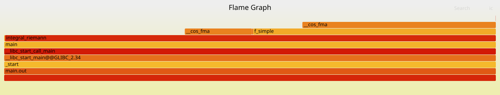
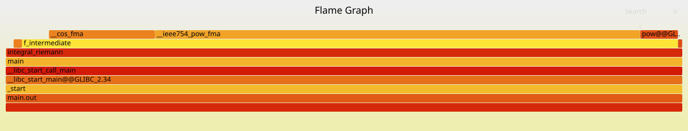
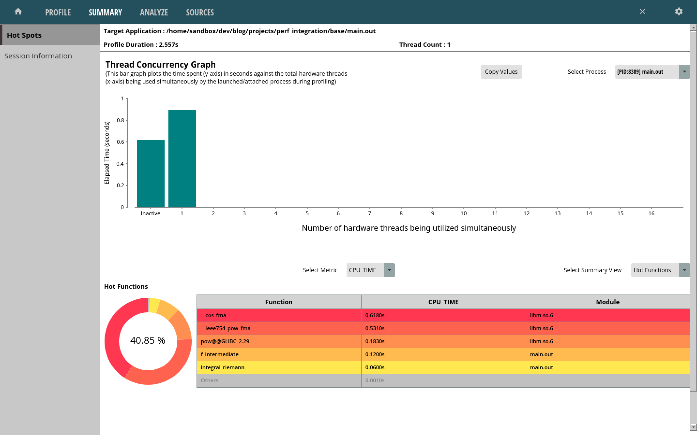
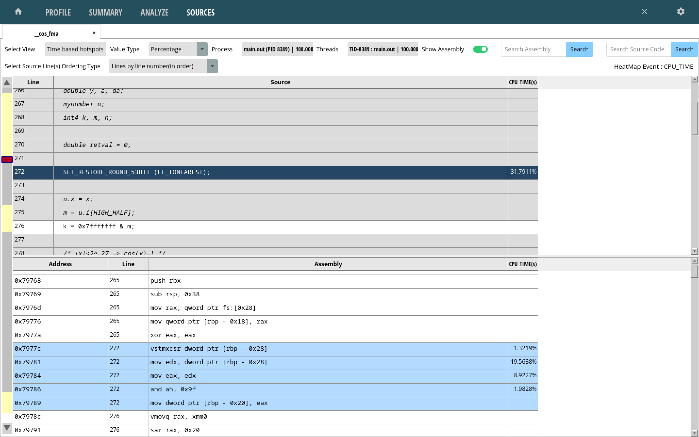
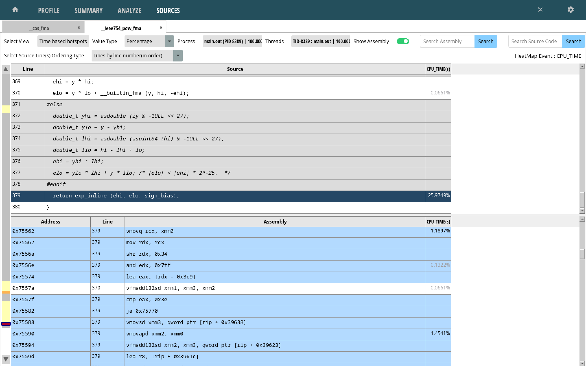
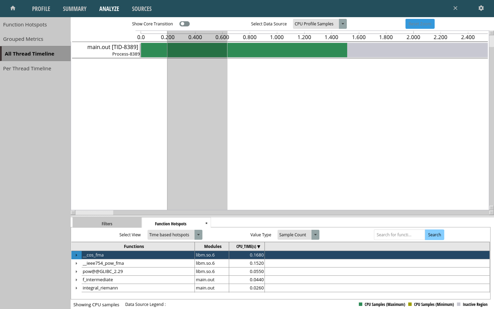

### Measuring Performance

This section explores different tooling used to measure software performance. It
exists as more of a journal of exploration more than something like a reference
page, although some of the contents will end up forming the base for a reference sheet.

To explore the different tools, the same basic testing code is used from the
initial setup:

```C
    double a = 0;
    double b = M_PI/4;
    double split = 1000;

    double ans_riemann = integral_riemann(f_simple, b, a, split);
    double ans_analytical = integral_analytical(antiderivative_f_simple, b, a);
    printf("Riemann:\t\t%g\n", ans_riemann);
    printf("Analytical:\t%g\n", ans_analytical);
```

The `split` variable varies (which tracks how many rectangles are used to compute
a Riemann sum),
and the integral functions being examined vary from the simple function to the
intermediate one.

<hr>

### time

A basic way to measure execution time is with the `time` utility (a shell built-in command or the `/bin/time` utility).

Time spent executing library functions is not particularly interesting if we're just trying to
measure the Riemann integral function, so the `printf()` calls are removed. Additionally, the
analytical integral function call is also removed (even if it won't impact execution time much).
The program is then recompiled and ran with the `time utility`:

```
$ gcc -lm -Wall -o main.out
$ /bin/time ./main.out

0.00user 0.00system 0:00.00elapsed 85%CPU (0avgtext+0avgdata 1664maxresident)k
0inputs+0outputs (0major+80minor)pagefaults 0swaps
```

This isn't the most helpful output- changing `split` to 1 billion and recompiling should help:

```
6.64user 0.00system 0:06.68elapsed 99%CPU (0avgtext+0avgdata 1664maxresident)k
0inputs+0outputs (0major+80minor)pagefaults 0swaps
```

Trying the same test for the intermediate integral:

```
14.57user 0.00system 0:14.60elapsed 99%CPU (0avgtext+0avgdata 1792maxresident)k
0inputs+0outputs (0major+85minor)pagefaults 0swaps
```

These values are more serviceable, however they are still a bit coarse grained.
It would also be nicer if the impact of function calls could be measured
individually- `clock_gettime()` can help with this.

<hr>

### clock_gettime

`clock_gettime()` is a system call that can be used to obtain system timestamps, and thus can be
used to calculate how long certain operations take.

The following snippet demonstrates how this function might be used to time an arbitrary function call `sample_func()`.

```C
#include <time.h>

struct timespec time1;
struct timespec time2;

clock_gettime(CLOCK_MONOTONIC, &time1);
sample_func();
clock_gettime(CLOCK_MONOTONIC, &time2);

double result_sec = time2.tv_sec - time1.tv_sec;
double result_nsec = time2.tv_nsec - time1.tv_nsec;
```

The absolute time required to execute something depends on many factors and isn't exceptionally
relevant- it's much more relevant to see how the execution time
might change after implementing various optimisations. Just for fun
though, the time between two successive `clock_gettime()` calls with no work in
between is calculated:

```
  struct timespec time1;
  struct timespec time2;

  clock_gettime(CLOCK_MONOTONIC, &time1);
  clock_gettime(CLOCK_MONOTONIC, &time2);

  double result_sec = time2.tv_sec - time1.tv_sec;
  double result_nsec = time2.tv_nsec - time1.tv_nsec;

  printf("Result seconds: %g | nanoseconds: %g\n", result_sec, result_nsec);
```

The obtained results fluctuated between 70 - 80+ nanoseconds on my machine
(AMD Ryzen 7840u CPU).

Back to the integral code, the simple function was tested first with the results converted to microseconds. The `split` was set to 100 million:

```C
    double a = 0;
    double b = M_PI/4;
    double split = 10000000;

    struct timespec time1, time2;
    clock_gettime(CLOCK_MONOTONIC, &time1);
    double ans_riemann = integral_riemann(f_simple, b, a, split);
    clock_gettime(CLOCK_MONOTONIC, &time2);

    double result = (time2.tv_sec - time1.tv_sec) * 1e6 + (time2.tv_nsec - time1.tv_nsec) / 1e3;    // in microseconds

    printf("Microseconds: %g\n", result);
```

The measured time was ~117000 microseconds. The intermediate
integral clocked in at ~187000+ microseconds.

An ugly macro was created to help quickly time arbitrary function calls:

```C
#define TIME_FUNC(TARGET_FUNC_CALL) ({ \
    struct timespec time1, time2; \
    clock_gettime(CLOCK_MONOTONIC, &time1); \
    TARGET_FUNC_CALL; \
    clock_gettime(CLOCK_MONOTONIC, &time2); \
    (time2.tv_sec - time1.tv_sec) * 1e6 + (time2.tv_nsec - time1.tv_nsec) / 1e3; \
    })
```

It can be used in a setup to measure average execution time of some function call:

```C
    double time_results = 0.0;
    int count = 10;
    for (int i = 0; i < count; i++) {
        time_results += TIME_FUNC(integral_riemann(f_simple, b, a, split));
    }
    time_results /= count;

```

This macro will find a little use in a couple of places in future sections.

Some small internal details `clock_gettime()` are included below for fun:

<details>
<summary>clock_gettime() Internals</summary>

Opening up the output program in `gdb` and stepping through reveals that glibc ends up going into
the [vDSO](https://en.wikipedia.org/wiki/VDSO) to call `clock_gettime()`. This is a mechanism
for accessing certain kernel functions from userland without performing a user -> kernel context
switch, speeding up performance. Stepping through the call stack yields the following:

```
───────────────────────────────────────────────────────────────────────────────────────────── trace ────
[#0] 0x7ffff7fc6ac0 → rdtsc_ordered()
[#1] 0x7ffff7fc6ac0 → __arch_get_hw_counter(vd=0x7ffff7fc2080, clock_mode=0x1)
[#2] 0x7ffff7fc6ac0 → do_hres(ts=<optimized out>, clk=<optimized out>, vd=<optimized out>)
[#3] 0x7ffff7fc6ac0 → __cvdso_clock_gettime_common(ts=0x7fffffffda10, clock=0x1, vd=<optimized out>)
[#4] 0x7ffff7fc6ac0 → __cvdso_clock_gettime_data(vd=<optimized out>, ts=0x7fffffffda10, clock=0x1)
[#5] 0x7ffff7fc6ac0 → __cvdso_clock_gettime(ts=0x7fffffffda10, clock=0x1)
[#6] 0x7ffff7fc6ac0 → __vdso_clock_gettime(clock=0x1, ts=0x7fffffffda10)
[#7] 0x7ffff7db2f7d → __GI___clock_gettime(clock_id=<optimized out>, tp=<optimized out>)
[#8] 0x40141c → main(argc=0x1, arg=0x7fffffffdb68)
────────────────────────────────────────────────────────────────────────────────────────────────────────
```

The [source for the `rdtsc_ordered()` kernel function](https://elixir.bootlin.com/linux/v6.10.8/source/arch/x86/include/asm/msr.h#L212),
as well as the code disassembly shows that the `rdtscp` x86_64 instruction ends up being used
to obtain a timestamp value.

```
─────────────────────────────────────────────────────────────────────────────────────── code:x86:64 ────
   0x7ffff7fc6ab7 <clock_gettime+71> mov    eax, DWORD PTR [r11+0x4]
   0x7ffff7fc6abb <clock_gettime+75> cmp    eax, 0x1
   0x7ffff7fc6abe <clock_gettime+78> jne    0x7ffff7fc6b3f <__vdso_clock_gettime+207>
 → 0x7ffff7fc6ac0 <clock_gettime+80> rdtscp
   0x7ffff7fc6ac3 <clock_gettime+83> xchg   ax, ax
   0x7ffff7fc6ac5 <clock_gettime+85> shl    rdx, 0x20
   0x7ffff7fc6ac9 <clock_gettime+89> or     rdx, rax
   0x7ffff7fc6acc <clock_gettime+92> btr    rdx, 0x3f
   0x7ffff7fc6ad1 <clock_gettime+97> sub    rdx, QWORD PTR [r11+0x8]
```

This instruction obtains the time value by [reading the processor's time stamp counter](https://www.felixcloutier.com/x86/rdtscp).
</details>

<hr>

### gprof

Next on the investigation list are software profiling tools, which can provide good insights into
program performance.

`gprof` is one such profiling tool. A quick start guide can be found [here](https://web.eecs.umich.edu/~sugih/pointers/gprof_quick.html), with a more detailed manual available [here](https://ftp.gnu.org/old-gnu/Manuals/gprof-2.9.1/html_mono/gprof.html).

This tool requires that programs are compiled with support for profiling- the `-pg` flag must be added to the `gcc` compilation command.

Inspecting the generated object object file with `objdump` shows some of the instrumentation
that was added, such as the insertion of `mcount()` function calls at the beginning of functions

```
$ objdump -d main.out -M intel |rg integral_riemann -A 5

000000000040134f <integral_riemann>:
  40134f:	55                   	push   rbp
  401350:	48 89 e5             	mov    rbp,rsp
  401353:	48 83 ec 40          	sub    rsp,0x40
  401357:	e8 24 fd ff ff       	call   401080 <mcount@plt>
  40135c:	48 89 7d d8          	mov    QWORD PTR [rbp-0x28],rdi

...
```

`mcount` is a [function in libc](https://github.com/lattera/glibc/blob/master/gmon/mcount.c) that
looks like it performs some program counter tracking.

Running the instrumented binary causes a `gmon.out` output file to be created. This is used by
`gprof` to generate its report. This can be done with the following command, specifying the
output binary and `gmon.out` file:

```
gprof main.out gmon.out > gprof.output
```

For the test, a `split` value of 100 million was used.

`gprof.output` included the following flat profile:

```
Flat profile:

Each sample counts as 0.01 seconds.
  %   cumulative   self              self     total
 time   seconds   seconds    calls  ms/call  ms/call  name
 72.73      0.24     0.24 100000000     0.00     0.00  f_simple
 15.15      0.29     0.05        1    50.00   290.00  integral_riemann
 12.12      0.33     0.04                             _init
  0.00      0.33     0.00        2     0.00     0.00  antiderivative_f_simple
  0.00      0.33     0.00        1     0.00     0.00  integral_analytical
```

According to this, ~73% of program execution time was spent in `f_simple`, and ~15% was spent
in `integral_riemann`. Comparatively, the analytical solution ran in no time at all (as expected).

Note that these percentages varied across different runs, however this still
provides some hints about the most important places that optimisations could be
performed.

The same test was ran with the intermediate integral, which yielded the following information in
the `gprof` report:

```
Flat profile:

Each sample counts as 0.01 seconds.
  %   cumulative   self              self     total           
 time   seconds   seconds    calls  ms/call  ms/call  name    
 75.68      0.28     0.28 100000000     0.00     0.00  f_intermediate
 13.51      0.33     0.05        1    50.00   330.00  integral_riemann
 10.81      0.37     0.04                             _init
  0.00      0.37     0.00        2     0.00     0.00  antiderivative_f_intermediate
  0.00      0.37     0.00        1     0.00     0.00  integral_analytical
```

This shows that the total runtime was slightly higher, as expected.

<hr>

### perf

This section reviews the Linux `perf` tool, which uses performance counters
and tracepoints to perform software profiling.

Some good resources can be found on the [wiki](https://perfwiki.github.io/main/)
as well as [Brendan Gregg's article](https://www.brendangregg.com/perf.html) on the tool. The tests performed below and general structure of this section are
gathered from these resources.

`perf list` lists all the events that can be captured (turns out there
are quite a few, although the line number below doesn't correspond to the count
of actual events).

```
perf list | wc -l

1394
```

<br>

#### Events

`perf stat` gathers performance statistics for the command it runs. The
`-d` flag specifies that more detailed statistics should be printed (can
be invoked 3 times- the first level provides L1 and LLC (Last Level Cache)
details). `-r` specifies how many times to repeat the command, with the
average values and standard deviations being printed for each metric.

These tests are performed with a `split` value of 100 million. Running the
simple integral:

```
$ perf stat -d -r 10 ./main.out

Performance counter stats for './main.out' (10 runs):

            671.71 msec task-clock:u                     #    0.997 CPUs utilized               ( +-  0.36% )
                 0      context-switches:u               #    0.000 /sec            
                 0      cpu-migrations:u                 #    0.000 /sec            
                72      page-faults:u                    #  107.190 /sec                        ( +-  0.86% )
     3,283,751,084      cycles:u                         #    4.889 GHz                         ( +-  0.10% )  (71.25%)
         1,080,415      stalled-cycles-frontend:u        #    0.03% frontend cycles idle        ( +- 19.05% )  (71.40%)
     9,396,590,420      instructions:u                   #    2.86  insn per cycle  
                                                  #    0.00  stalled cycles per insn     ( +-  0.02% )  (71.53%)
     1,099,979,799      branches:u                       #    1.638 G/sec                       ( +-  0.04% )  (71.52%)
             6,819      branch-misses:u                  #    0.00% of all branches             ( +-  1.34% )  (71.52%)
     3,102,327,767      L1-dcache-loads:u                #    4.619 G/sec                       ( +-  0.02% )  (71.47%)
             2,629      L1-dcache-load-misses:u          #    0.00% of all L1-dcache accesses   ( +- 12.58% )  (71.31%)
   <not supported>      LLC-loads:u                                                 
   <not supported>      LLC-load-misses:u                                           

           0.67380 +- 0.00261 seconds time elapsed  ( +-  0.39% )
```

It's interesting to see the amount of variation that some of the statistics
have- it gives some indication of which ones might be relevant to compare
across different program runs (although this wasn't always representative of the real variation that could be seen across runs- many more repetitions would be needed to get a more accurate view of these).

Running the intermediate integral:

```
 Performance counter stats for './main.out' (10 runs):

          1,479.49 msec task-clock:u                     #    0.998 CPUs utilized               ( +-  1.88% )
                 0      context-switches:u               #    0.000 /sec            
                 0      cpu-migrations:u                 #    0.000 /sec            
                73      page-faults:u                    #   49.341 /sec                        ( +-  0.80% )
     7,193,718,348      cycles:u                         #    4.862 GHz                         ( +-  1.89% )  (71.37%)
         1,805,625      stalled-cycles-frontend:u        #    0.03% frontend cycles idle        ( +- 11.08% )  (71.37%)
    23,503,633,295      instructions:u                   #    3.27  insn per cycle  
                                                  #    0.00  stalled cycles per insn     ( +-  0.01% )  (71.42%)
     2,400,189,382      branches:u                       #    1.622 G/sec                       ( +-  0.02% )  (71.48%)
            10,829      branch-misses:u                  #    0.00% of all branches             ( +-  1.60% )  (71.52%)
     6,500,940,982      L1-dcache-loads:u                #    4.394 G/sec                       ( +-  0.01% )  (71.46%)
         7,386,942      L1-dcache-load-misses:u          #    0.11% of all L1-dcache accesses   ( +- 99.94% )  (71.38%)
   <not supported>      LLC-loads:u                                                 
   <not supported>      LLC-load-misses:u                                           

            1.4820 +- 0.0277 seconds time elapsed  ( +-  1.87% )
```

Many more instructions were executed in the intermediate integral example,
although interestingly the amount of cycles increased by less of a factor-
more instructions ended up being executed per cycle.

<br>

#### Profiling

`perf record` can be used to collect sample data from a program run into a
`perf.data` file that can be explored with `perf report`. A sampling
frequency can be set with the `-F` option. Since these programs have a fairly
short runtime, this was set to 50,000.

These tests are performed with a `split` value of 100 million. Running the simple
integral:

```
$ perf record -F 50000  ./main.out

[ perf record: Woken up 6 times to write data ]
[ perf record: Captured and wrote 1.351 MB perf.data (35359 samples) ]

$ perf report --percent-limit 1
```

This produces the following report:

```
Samples: 35K of event 'cycles:Pu', Event count (approx.): 3327017536
Overhead  Command   Shared Object         Symbol
  93.86%  main.out  libm.so.6             [.] __cos_fma
   3.64%  main.out  main.out              [.] integral_riemann
   2.03%  main.out  main.out              [.] f_simple
```

These are expected values- the simple integral function just calls the cosine math
function. Note that these percentage values can also vary substantially across
runs, although the main functions of interest do not change.

Running against the intermediate integral produces the following report:

```
Samples: 76K of event 'cycles:Pu', Event count (approx.): 7199617188
Overhead  Command   Shared Object         Symbol
  62.95%  main.out  libm.so.6             [.] __cos_fma
  16.99%  main.out  libm.so.6             [.] __ieee754_pow_fma
   9.20%  main.out  main.out              [.] f_intermediate
   8.49%  main.out  libm.so.6             [.] pow@@GLIBC_2.29
   2.31%  main.out  main.out              [.] integral_riemann
```

Again, the percentage values varied across runs, however the highest overhead
functions of `cos()` and `pow()` remained the same.

Call stacks can be reported and inspected by running `perf` with the `-g` flag

```
$ perf record -F 50000 -g ./main.out

$ perf report

Samples: 68K of event 'cycles:Pu', Event count (approx.): 6084489230
  Children      Self  Command   Shared Object         Symbol
+  100.00%     0.00%  main.out  main.out              [.] _start                        ▒
+  100.00%     0.00%  main.out  libc.so.6             [.] __libc_start_main@@GLIBC_2.34 ▒
+  100.00%     0.00%  main.out  libc.so.6             [.] __libc_start_call_main        ▒
+  100.00%     0.00%  main.out  main.out              [.] main                          ▒
+   99.91%     3.24%  main.out  main.out              [.] integral_riemann              ▒
+   92.39%     5.93%  main.out  main.out              [.] f_intermediate                ▒
-   71.84%    71.83%  main.out  libm.so.6             [.] __cos_fma                     ▒
     71.83% _start                                                                      ▒
        __libc_start_main@@GLIBC_2.34                                                   ▒
        __libc_start_call_main                                                          ▒
        main                                                                            ▒
      - integral_riemann                                                                ▒
         - 68.37% f_intermediate                                                        ▒
              __cos_fma                                                                 ▒
           3.46% __cos_fma                                                              ▒
+   12.48%    12.48%  main.out  libm.so.6             [.] __ieee754_pow_fma             ▒
+    6.47%     6.47%  main.out  libm.so.6             [.] pow@@GLIBC_2.29      
```

<br>

#### Flamegraphs

This section explores the generation of CPU flame graphs for visualisation of
profiling data.

The resources for this section are [Brendan Gregg's article on the topic](https://www.brendangregg.com/FlameGraphs/cpuflamegraphs.html)
and the associated [git repository](https://github.com/brendangregg/FlameGraph).

The `flamegraph.pl` and `stackcollapse.pl` scripts were available either from the git
repository or as a package (Fedora 6.8.5-301.fc40.x86_64). There were several
variations of the `stackcollapse.pl` script available for different tools and
languages.

Following the guide resulted in an SVG flame graph being generated:

```
perf record -F 50000  -g ./main.out
perf script | stackcollapse-perf.pl > out-simple.perf-folded
flamegraph.pl out-simple.perf-folded > perf-simple.svg
```



Running the tooling against the `f_intermediate` code example yielded the
following graph:



This gives some of the same insights seen with `perf report`, except visually-
when considering optimisations for the `f_intermediate` function, greater benefits
would come from focusing on the `pow()` function as compared to the `cos()` function.

The visual aspect is likely to be quite helpful for more complex projects where
`perf report` may become hard to parse

<hr>

### eBPF

This section explores the usage of [eBPF](https://lwn.net/Articles/740157/) to
perform performance related tracing.

The general idea is that this system can run user specified programs inside kernel
space. Originally this was to perform tasks such as network packet filtering,
although the number of supported features has grown substantially.

eBPF programs can be created in several ways, including:

- Writing the BPF program and leveraging the `libbpf` library to load programs
- Using [`bcc`](https://github.com/iovisor/bcc) to load programs at a higher level with Python, with additional helper functionality
- Using the [`bpftrace`](https://github.com/bpftrace/bpftrace) tool to run tracing scripts, which uses systems like `libbpf` under the hood to load the programs

While the first two options present opportunities for much finer grained control
of tracing programs, `bpftrace` was examined here for its ease of use and ability
to rapidly explore different aspects of tracing.

The resources used here include [Brendan Gregg's article on `bpftrace`](https://www.brendangregg.com/blog/2019-08-19/bpftrace.html)
as well as the [`bpftrace` repository](https://github.com/bpftrace/bpftrace/blob/master/man/adoc/bpftrace.adoc),
which provides a lot of documentation along with a tutorial.

There are a very large number of tracepoints available for tracing (unlike the `perf` case, the line number does correspond the the number of tracepoints)

```
$ sudo bpftrace -l |wc -l

158935
```

Some of these are hardware related, and were also seen in the `perf` tool tests:

```
hardware:backend-stalls:
hardware:branch-instructions:
hardware:branch-misses:
hardware:branches:
hardware:bus-cycles:
hardware:cache-misses:
hardware:cache-references:
hardware:cpu-cycles:
hardware:cycles:
hardware:frontend-stalls:
hardware:instructions:
hardware:ref-cycles:
```

Most of the available tracepoints exist at various points in the kernel, and 
since the example code spends the most time in userspace/library code, most 
of the tracepoints won't end up being relevant (although they would be very
relevant for many other use cases, including system wide tracing).

Other than the hardware events, the most applicable feature of eBPF in the example
code are `uprobes`- a feature that allows dynamic tracing of userspace functions.

The following script generates a histogram of the amount of time spent executing
the `f_simple` function, in nanoseconds:

```

uprobe:./main.out:f_simple {
    @start[tid] = nsecs;
}

uretprobe:./main.out:f_simple
/@start[tid]/
{
    @times = hist((nsecs - @start[tid]));
    delete(@start[tid]);
}

END {
    clear(@start);
}
```

Running `bpftrace` with this `trace.bt` script:

```
$ sudo bpftrace trace.bt -c main.out
Attaching 3 probes...


@times:
[512, 1K)       99803747 |@@@@@@@@@@@@@@@@@@@@@@@@@@@@@@@@@@@@@@@@@@@@@@@@@@@@|
[1K, 2K)           64066 |                                                    |
[2K, 4K)           66444 |                                                    |
[4K, 8K)           65100 |                                                    |
[8K, 16K)            177 |                                                    |
[16K, 32K)           434 |                                                    |
[32K, 64K)            32 |                                                    |

```

Note this took a lot longer to execute than normally running the program or using
perf- adding overhead to the hottest execution path was not a smart move.

Tracing the Riemann integral function is a better idea- the script was modified
to do this and compare the two integral functions. Having the histogram also
didn't make a lot of sense for the use case, so this is changed to simply
outputting the microsecond count spent exeucting the function


```
uprobe:./main.out:integral_riemann {
    @start[tid] = nsecs;
}

uretprobe:./main.out:integral_riemann
/@start[tid]/
{
    // Microsecond time difference
    printf("Microseconds in Riemann integral: %lld\n", (nsecs - @start[tid]) / 1e3);
    delete(@start[tid]);
}

uprobe:./main.out:integral_analytical {
    @start_analytical[tid] = nsecs;
}

uretprobe:./main.out:integral_analytical
/@start_analytical[tid]/
{

    printf("Microseconds in analytical integral: %lld\n", (nsecs - @start_analytical[tid]) / 1e3);
    delete(@start_analytical[tid]);
}

END {
    clear(@start);
    clear(@start_analytical);
}

$ sudo bpftrace trace.bt -c main.out
Attaching 5 probes...
Microseconds in Riemann integral: 655934
Microseconds in analytical integral: 6
```

This matches with the ballpark previously, however eBPF provides
the functionality to build much more powerful tools. Things like access to function
arguments, return values, stack traces, and other built-in features in a
programmatic fashion allows for building great tracing tools
(not to mention the level of kernel introspection available).

The `bpftrace` repository has a [good amount of tooling](https://github.com/bpftrace/bpftrace/tree/master/tools)
examples available.

<hr>

### AMD uProf

AMD provides [profilers for their CPUs](https://www.amd.com/en/developer/uprof.html). 
They also provide a [user guide here](https://docs.amd.com/r/en-US/57368-uProf-user-guide/Linux?tocId=IXzJcuD~2K84EdLaAi3X8g).

CLI and GUI tools are included in the provided tooling, as well as several
code examples.

The output of the `AMDuProf` GUI tool is examined here.

The tool allows selection of a program to profile- the example code running
`f_intermediate` was chosen.

The following summary was output:



As with the flame graphs from before, the summary view quickly points out functions
of interest. Clicking on any of the functions brings up a more detailed view,
including source lines/instructions pointing out where the greatest amount of time
was spent:



In the above case, a large portion of time seems to have been spent in the
instructions associated with the `SET_RESTORE_ROUND_53BIT()` call.

Looking at the `pow()` function summary shows that a large amount of time
was spent in the `exp_inline()` call.



There is also the ability to look at calls made in a slice of the execution
timeline:



Next, we begin looking at optimisations.

<br>
[Introduction](introduction.html)
<p style="text-align: right">
[Single core optimisations](optimisation-singlecore.html)
</p>
